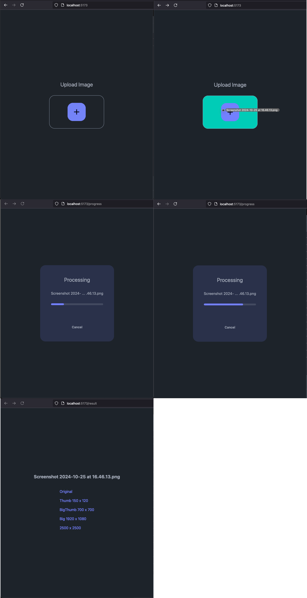
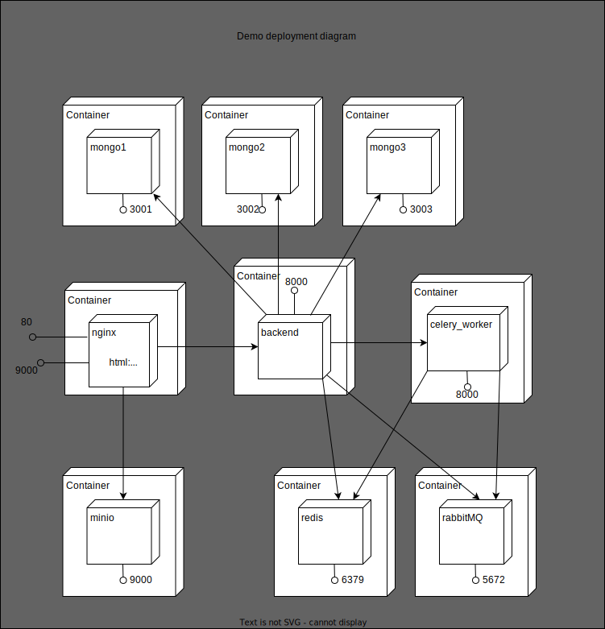

# Image resize app  
### [Link to Start demo](#start-demo)
## App concept
The app takes an image upload,
does resizing in four particular formats  
outputs processed images for download.

Processed image sizes:
- Original
- thumb: 150x120, to_fit
- big_thumb: 700x700, to_fit
- big_1920, 1920x1080, to_fit
- d2500: 2500x2500, to_fit

<details>
<summary>Basic Figma prototype for the app.</summary>

</details>


## System design considerations
- Repository pattern
- Unit of work pattern
- Event Bus pattern

## Work items

- [x] Backend
  - [x] model business Domain
  - [x] implement REST api in FastApi
  - [x] WebSocket
    - [x] model websocket schema using asyncapi
    - [x] implement Websocket Manager 
  - [x] implement Repository pattern
  - [x] implement Unit of work pattern
  - [x] implement Event Bus pattern
  - [x] implement Celery background tasks
  - [x] implement Pytest unit and integration tests
- [x] Frontend
  - [x] Figma prototype
  - [x] implement ReactJS frontend
- [x] Demo
  - [x] Dockerfile and docker-compose for demo

## Start Demo

```shell
git clone https://gitlab.com/telei/image-resize.git;
echo "127.0.0.1    minio.example.com" | sudo tee -a /etc/hosts;  # workaround for local minio nginx deployment: append its hostname to the hosts file
cd image-resize;
make demo.up
```
Serves frontend on ***localhost:80***

## Finish Demo

```shell
make demo.clean
```

## Completed UI screenshots

Files can be downloaded by clicking on their links


## Devalopment and Test
### Prerequisites
- docker, docker-compose, NodeJs
- https://www.asyncapi.com/docs/tools/cli/installation

### Create .env file
- `backend/.env.dev` Copy form `backend/.env.dev.example`  
  
```shell
cd backend && \
make mongo.keyfile && \
make docker.up && \
make celery.start && \
make backend.start && \
make backend.test
cd ../fronedn && \
npm run dev
```

## Deployment diagram



<details>
<summary style="font-size: 1.5rem; font-weight: bold;">
Requirements document
</summary>

## Вариант 1 - загрузка и обработка фоток

[Gist document](https://gist.github.com/scr1pt/29284cc45f2ebb3978529c69115741be)  

>Разработать api-интерфейс для высоконагруженной загрузки изображений.

Описание:

У вас есть поток загрузки фотографий. 
Примерно 130 000 штук за сутки, в среднем по 4 мб.

Придумать архитектуру и реализовать минимальный функционал по обработке фотографий.

Версии фоток:
- Original
- thumb: 150x120, to_fit
- big_thumb: 700x700, to_fit
- big_1920, 1920x1080, to_fit
- d2500: 2500x2500, to_fit

to_fit - значит ресайзится по длинной стороне.

Технические ограниения:
- Python, Web API
- Можно использовать любую базу данных
- Можно использовать любой S3 сервис, но лучше иметь в виду, что будем держать свой.

Минимальный функционал:
1. АПИ для загрузки с клиента. Запрос на загрузку, получение ссылки куда грузить файл.
2. Использование внешнего хранилища, s3
3. Использование docker-compose
4. Организация процессинга
5. Использовать веб сокеты для оповещения о готовности фотки.
6. **Покрыть тестами, чтобы все проходило(И сокеты и API)**

Дополнительно, написать предложение:
1. по масштабируемому процессингу - как организовать?
2. как сделать надежное свое s3 хранилище?
3. если будет желание, сделать минимальную веб версию для тестов

### API примерное

### POST /images/

#### REQUEST
```
{
	filename: 'hello.jpg', // имя файла для загрузки
	project_id: 111, // проект, в который грузится фотка
}
```


#### RESPONSE

```
{
   upload_link: '....',
   params: {} // Возможно параметры для POST запроса
}
```


### GET /projects/{id}/images

#### RESPONSE 

```
{
	images: [
		{
			image_id: '',
			state: 'init', // uploaded, processing, done, error
			project_id: '',
			versions: {
				original: '',
				thumb: '',
				big_thumb: '',
				big_1920: '',
				d2500: ''
			}
		}
	]
}
```


### Websockets

Когда фотка обработана, нужно получать событие по проекту. Клиент подписывается на проект, используя project_id, в момент, когда фотка обрабатывается, отправляется событие с обновлением статуса.

</details>